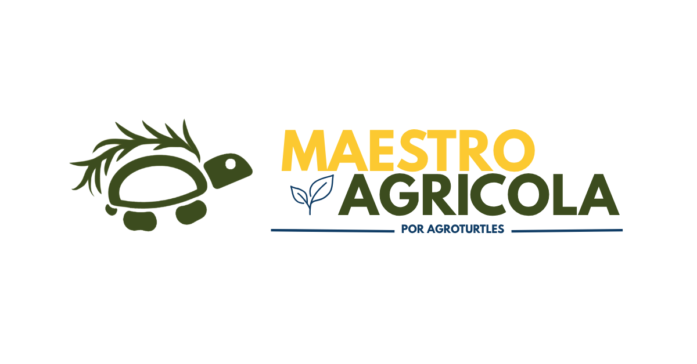

# Maestro Agrícola

<p align="center">
  
  <a href="https://github.com/vvvvvdal/maestro-agricola/actions/workflows/ci-quick.yml">
    
  </a>
  <a href="https://github.com/vvvvvdal/maestro-agricola/actions/workflows/android-full.yml">
    
  </a>
</p>

<p align="center">
  
</p>

Interface hands-free para comandar maquinário agrícola autônomo com visão, voz e confirmação por áudio.

O Maestro Agrícola permite que o operador olhe para um alvo no campo, diga a ação desejada e confirme o comando sem interromper o trabalho para usar notebook ou tablet. O aplicativo companion interpreta a intenção, associa o alvo visual a uma posição conhecida e envia um comando estruturado ao robô.

> Estado: MVP pré-hardware integrado e validado ponta a ponta em 22/08/2026 para o Programa AI Glasses Brasil 2026.

## Jornada principal

1. **Olhar:** no produto, a câmera dos óculos captura o alvo centralizado; no MVP pré-hardware, o DAT 0.9.0 usa o MockDeviceKit explicitamente identificado.
2. **Falar:** o operador diz a ação, por exemplo: “pulverizar esta área”.
3. **Confirmar:** o sistema responde por áudio e só executa após confirmação explícita.

## MVP do hackathon

O corte vertical demonstra o fluxo completo:

```text
AI Glasses ou mock -> app Kotlin -> IA local + alvo -> JSON/WebSocket -> ROS 2/Nav2/Gazebo
```

Para manter a demonstração verificável, o alvo do MVP será um marcador visual ou talhão previamente mapeado. A versão atual do Meta Wearables Device Access Toolkit (DAT) não expõe pose/IMU dos óculos; portanto, nenhuma parte crítica do MVP depende desse dado.

## Princípios

- Segurança: nenhum comando de movimento é enviado sem confirmação por áudio.
- Privacidade: imagens são processadas em memória e descartadas; não há persistência por padrão.
- Eficiência: captura sob demanda, sem streaming contínuo quando não for necessário.
- Portabilidade: integração com o robô por contrato JSON, sem acoplamento a um fabricante.
- Testabilidade: desenvolvimento antecipado com Mock Device Kit e ROS/Gazebo.

## O que já existe

- contrato JSON 1.0 com confirmação, expiração e UUID;
- classificador operacional local no Android com `SPRAY`, `DOCK`, `UNDOCK`, `CONFIRM`, `CANCEL` e `UNKNOWN`;
- app Android com flavors `mock` (API 26+) e `dat` (API 31+);
- bridge WebSocket/ROS 2 com rejeição de comando inseguro e deduplicação;
- lifecycle sem `undock`, retorno à doca ou `dock` implícitos após `SPRAY`; `DOCK` e `UNDOCK` são comandos explícitos;
- cenário Gazebo com três placas (`plot-01` a `plot-03`), Nav2 e TurtleBot 4;
- resolvedor compartilhado que combina alvo visual e ID falado e recusa conflitos;
- integração DAT 0.9.0 pré-hardware com ciclo de sessão/câmera, MockDeviceKit e QR local via ZXing;
- interface Android/Compose de demonstração com alvo, intenção, confirmação e execução;
- runtime local Qwen2.5-1.5B Q4_K_M via `llama.cpp`, validado em smoke físico no SM-X510;
- Dockerfile e Compose para reproduzir o simulador e cliente mock para testes sem hardware.

O caminho DAT pré-hardware está implementado e foi validado no Android físico com `datDebug` + MockDeviceKit. Essa é a evidência da etapa de seleção de 22/08/2026. Sessão/câmera e rota real de áudio nos Meta Wearables físicos são um gate posterior caso a equipe avance para a fase presencial. Resultado com MockDeviceKit nunca deve ser apresentado como captura física.

### IA operacional e assistente local

O Qwen não substitui o classificador operacional. O benchmark versionado mostrou que o Qwen2.5-1.5B não é seguro o suficiente para decidir comandos críticos: 36/48 acertos e 3 aceites perigosos no corpus de seis rótulos. Por isso, `LocalIntentClassifier` continua responsável por `SPRAY`, `DOCK`, `UNDOCK`, `CONFIRM` e `CANCEL`.

A infraestrutura de assistente local está conectada à `MainActivity`: `LanguageRouter` envia somente `UNKNOWN` para `QwenDomainAssistant`, cuja saída é limitada por GBNF a `CHAT` ou `OUT_OF_SCOPE`; saída malformada falha para `OUT_OF_SCOPE`. Operações continuam no `InteractionEngine`. O GGUF não é empacotado no APK, então o assistente só fica disponível quando o modelo é provisionado no diretório privado do app; sua ausência não afeta o caminho operacional.

Detalhes e evidências: [`docs/tasks/qwen-android-runtime.md`](docs/tasks/qwen-android-runtime.md).

## Estrutura

```text
.
├── AGENTS.md
├── README.md
├── contracts/           # schemas e fixtures JSON
├── mobile/
│   └── android/         # Kotlin, mock API 26+ e DAT API 31+
├── robot_ws/src/        # bridge ROS 2 e cenário Gazebo
├── shared/ai/           # dataset, modelo local e avaliação
├── tests/               # catálogo central: portátil, Android, ROS e hardware
├── tools/               # treino, QR e simulador de óculos
└── docs/                # spec, arquitetura, tarefas, proposta, pitch e paper IEEE
```

O artigo científico do projeto está em [`docs/paper/main.tex`](docs/paper/main.tex), com instruções de compilação em [`docs/paper/README.md`](docs/paper/README.md).

## Teste em 5 minutos

### Resposta curta: como saber se funciona

Na `main`, o gate automatizado seguro que continua alinhado ao comportamento atual é:

```bash
make test-quick
```

A Task 7 validou o lifecycle explícito pelo Android físico. `make demo`, `make demo-route` e `make demo-visual` podem conservar expectativas históricas e permanecem apenas como diagnósticos; **não são o gate normativo do lifecycle atual**.

Para validar o fluxo atual no Gazebo, use o app: envie `UNDOCK` explicitamente quando o robô estiver dockado, confirme, depois envie `SPRAY`; o robô deve chegar ao plot e permanecer no destino. `DOCK` só acontece quando pedido. Não use os botões Dock/Undock do HMI como parte do E2E Maestro.

**Não abra `127.0.0.1:18765` no navegador**: essa é uma porta WebSocket, não uma página. Para encerrar a simulação, use `make simulation-down`.

### Pré-requisitos

- Linux com Python 3.10 ou superior;
- Docker Engine ativo e acessível pelo usuário;
- Docker Compose v2 ou superior;
- GNU Make.

Não é necessário instalar ROS 2 ou Gazebo no computador: ambos ficam dentro do contêiner.

### 1. Verifique o ambiente

```bash
make doctor
```

Todos os itens obrigatórios devem aparecer como `[OK]`. É normal o bridge aparecer como `[INFO]` antes da primeira demo.

### 2. Execute os testes rápidos

```bash
make test-quick
```

Esse comando verifica o modelo sem regravá-lo, executa as suítes portáteis e do bridge e valida o Compose. Ele não inicia o Gazebo.

Confira também a placa completa sem abrir o Gazebo:

```bash
make vision-smoke
```

A saída esperada contém três resultados `"status": "DETECTED"`, um para cada ID de `plot-01` a `plot-03`.

### 3. Demo automatizada legada — diagnóstico, não gate normativo

```bash
make demo
```

O comando continua útil para diagnóstico do caminho WebSocket/Nav2, mas seu critério histórico pode divergir do lifecycle atual. A evidência normativa da Task 7 é o E2E Android `datDebug` + MockDeviceKit com lifecycle explícito.

Uma resposta do bridge semelhante à abaixo continua sendo evidência de que o comando foi aceito e enfileirado:

```json
{
  "schema_version": "1.0",
  "command_id": "...",
  "status": "ACCEPTED",
  "reason": "navigation goal queued"
}
```

`ACCEPTED` significa que o mock classificou a intenção localmente, confirmou a ação, enviou o JSON e o bridge validou e enfileirou a meta do `plot-03`. No lifecycle atual, um `SPRAY` não deve causar `Undock`, retorno à doca ou `Dock` automaticamente.

Para testar todos os pontos em uma única rota limpa, headless e acelerada pela NVIDIA:

```bash
make demo-route
```

Esse comando exige o mesmo driver/runtime NVIDIA do modo visual e visita `plot-01`, `plot-02` e `plot-03` nessa ordem. Trate eventuais asserts históricos de retorno à doca como legado; use o fluxo Android da Task 7 como gate final do lifecycle explícito.

> A execução padrão é **headless**: nenhuma janela do Gazebo será aberta. O resultado aparece no terminal e nos logs. Isso é esperado.

### 4. Consulte estado e logs

```bash
make status
make logs
```

Os logs não fazem parte do teste normal. Consulte-os quando um smoke test ou demo não apresentar o comportamento esperado. Para acompanhar continuamente, use `make simulation-logs`. Pressionar `Ctrl+C` nesse comando interrompe apenas a visualização dos logs; o contêiner continua rodando.

### 5. Encerre

```bash
make simulation-down
```

Durante o encerramento, ROS e Gazebo podem registrar `SIGINT`, `SIGTERM`, `process has died` ou código `-15`. Depois que você pediu `simulation-down`, essas mensagens descrevem a finalização dos processos e não invalidam uma demo anteriormente aprovada.

O guia completo, incluindo reinício limpo, erros conhecidos e testes mobile, está em [`docs/testing.md`](docs/testing.md).

## Comandos separados

Como alternativa, execute `make simulation-up` e depois `make demo-client`. Não interrompa o simulador com `Ctrl+C` antes de executar o cliente. Em celular físico, configure no app `ws://IP_DO_COMPUTADOR:18765`. A porta `18765` evita o conflito observado entre a `8765` e serviços do simulador.

O Compose executa Gazebo e sensores em uma tela virtual interna, portanto não exige liberar o monitor do computador para o contêiner. Em máquinas sem GPU, comandos recebidos enquanto o Nav2 termina de iniciar ficam na fila até ele estar realmente ativo.

## Ver o Gazebo e o RViz2 com a NVIDIA

O modo visual segue o fluxo que já funcionava no `pluginbot-turtlebot4`: Gazebo, ROS 2 e RViz rodam dentro do mesmo contêiner, com a sessão X11 do host e `gpus: all`. Ele exige driver NVIDIA, NVIDIA Container Toolkit e uma sessão Linux X11.

Primeiro abra uma simulação visual limpa:

```bash
make gazebo
```

Na primeira execução, aguarde o mundo terminar de baixar e carregar. O cache do Gazebo Fuel é preservado nas próximas aberturas. Quando o cenário aparecer, acompanhe uma jornada em outro terminal:

```bash
make demo-visual
```

> `make demo-visual` pode conservar asserts do lifecycle antigo. Para validar o comportamento atual, prefira o fluxo Android em que `UNDOCK` é explícito, `SPRAY` termina no plot e `DOCK` só ocorre quando solicitado.

Para ver mapa, robô, LiDAR, costmap e planos, abra em um terceiro terminal:

```bash
make rviz
```

`make gazebo` encerra uma instância anterior do projeto antes de iniciar a visual; não execute `make demo` enquanto ela estiver aberta, porque o teste padrão troca para o serviço headless. `make rviz` permanece no terminal até a janela ser fechada. Ao terminar, execute `make simulation-down`; além de remover o contêiner, o comando revoga a permissão X11 concedida ao usuário `root` do contêiner.

O Gazebo mostra o mundo 3D `warehouse`, o TurtleBot 4 e três placas bifaciais distribuídas: `PLOT-01` e `PLOT-02` em lados opostos da área central e `PLOT-03` no ponto original. O RViz mostra o mapa salvo, a pose estimada pelo AMCL, modelo do robô, LiDAR, costmap e planos global/local. Com as janelas abertas, `make demo-visual` envia e verifica o comando para acompanhar o movimento.

O cenário atual não é uma fazenda própria. `warehouse` e seu mapa de ocupação salvo vêm do simulador oficial do TurtleBot 4; o Maestro acrescenta as placas e usa AMCL com pose inicial na doca. As três poses seguras ficam no catálogo versionado do bridge. Esses são três artefatos diferentes: mundo 3D, mapa de ocupação e mapa lógico de alvos.

## Estado visual dos apps

O app Android/Compose apresenta a jornada como uma trilha de quatro passos — `Alvo`, `Intenção`, `Confirmar`, `Executar` — com cartões destacando alvo detectado e sua origem, intenção reconhecida com confiança, confirmação pendente com contagem regressiva e o último comando aceito pelo robô. A identidade AgroTurtles está aplicada. Endpoint WebSocket e transcrição digitada continuam disponíveis, recolhidos em "Ajustes de teste".

A confirmação continua exigindo áudio: nenhum botão de toque confirma um comando. O detalhamento da tela está em [`docs/tasks/android-demo-ui.md`](docs/tasks/android-demo-ui.md).

Para abrir o app, siga [`mobile/android/README.md`](mobile/android/README.md); é necessário JDK 17, Android SDK e Android Studio ou aparelho via `adb`.

## Testar a escolha do alvo

Com ID visual e fala genérica, a câmera resolve o alvo:

```bash
python3 tools/target_resolver.py "pulverize aqui" --visual-target plot-03
```

Sem QR, a fala explícita pode resolver um alvo que exista no catálogo:

```bash
python3 tools/target_resolver.py "pulverize no plot três"
```

Se voz e câmera divergirem, a saída é `CONFLICT`, sem `target_id`, e o processo termina com status diferente de zero. Isso é o comportamento seguro esperado:

```bash
python3 tools/target_resolver.py "pulverize no plot quatro" --visual-target plot-03
```

## Testando o aplicativo Android com o simulador

O aplicativo Android envia comandos para o `maestro_robot_bridge` por WebSocket na porta `18765`.

### Endereço do WebSocket

O endereço depende de onde o aplicativo está sendo executado.

**Emulador Android:**

```text
ws://10.0.2.2:18765
```

No emulador, `10.0.2.2` é o endereço especial usado para acessar a máquina host.

**Celular ou tablet físico:**

Use o endereço IPv4 do computador Ubuntu na mesma rede Wi-Fi.

Descubra o IP do computador com:

```bash
hostname -I
```

Exemplo:

```text
192.168.1.9
```

No aplicativo:

```text
ws://192.168.1.9:18765
```

Não use `10.0.2.2` em um dispositivo Android físico.

Confirme que o bridge está escutando:

```bash
ss -ltnp | grep 18765
```

Esperado:

```text
0.0.0.0:18765
```

Confirme também que a simulação está ativa:

```bash
docker compose --profile visual ps
```

### Antes dos testes

1. Inicie/recompile a simulação quando houver alterações no código ROS do container.
2. Aguarde Nav2 e o TurtleBot terminarem a inicialização.
3. Confirme que o Gazebo não está pausado.
4. No HMI do TurtleBot, use o namespace:

```text
turtlebot1
```

5. Se o robô estiver dockado, comandos normais de navegação são rejeitados. Envie `UNDOCK` explicitamente pelo app/HMI e confirme antes de iniciar uma navegação.

---

## Smoke tests Android → IA → ROS → TurtleBot

### Caso 1 — Pulverizar plot 02

Fale ou digite:

```text
pulverizar o plot 02
```

Esperado:

```text
IA: SPRAY
Estado: AWAITING_CONFIRMATION
```

Confirme falando ou digitando:

```text
sim
```

Esperado no aplicativo:

```text
Estado: ACCEPTED
navigation goal queued
```

Esperado no bridge:

```text
Nav2 accepted command ... for target plot-02
...
Nav2 completed command ... for target plot-02
```

O robô deve chegar ao `plot-02` e permanecer no destino.

Ele NÃO deve retornar automaticamente para a doca.

### Caso 2 — Variação de linguagem

Teste também frases semanticamente equivalentes, por exemplo:

```text
pulverizar o talhão 2
pulverize o plot 02
vá pulverizar o talhão dois
pulverização no plot 2
```

Registre quais frases foram reconhecidas corretamente e quais resultaram em `UNKNOWN` ou classificação incorreta. Sempre que possível, registre também a transcrição produzida pelo ASR:

```text
frase pretendida | transcrição ASR | intent esperada | target esperado | resultado
```

Essas variações devem permanecer no corpus de regressão do classificador operacional. Frases que terminarem em `UNKNOWN` são candidatas ao assistente apenas depois do wiring seguro da Task 6.

### Caso 3 — Confirmação por voz

Com uma ação aguardando confirmação, fale:

```text
sim
```

Esperado:

```text
CONFIRM
```

e somente então o comando pode ser enviado ao robô.

### Caso 4 — Cancelamento

Inicie uma ação e, durante a confirmação, fale:

```text
cancelar
```

Esperado:

```text
CANCEL
```

Nenhuma navegação deve ser enviada ao robô.

### Caso 5 — Robô dockado

Com `dock_status=true`, tente:

```text
pulverizar o plot 02
```

e confirme.

Esperado:

```text
robot unavailable: robot is docked
```

O bridge não deve executar `Undock` automaticamente.

### Logs úteis

Para acompanhar a missão:

```bash
docker compose --profile visual logs -f simulation-gui | \
grep --line-buffered -E "Nav2|dock|Dock|Undock|return|maestro_robot_bridge"
```

Para uma missão `SPRAY` normal, após:

```text
Nav2 completed command ... for target plot-XX
```

não deve aparecer um retorno automático para a doca.

## Ambiente mobile da demonstração

| Ambiente | Papel | Evidência da entrega de 22/08 |
|---|---|---:|
| Samsung SM-X510 + `datDebug` + DAT 0.9.0 + MockDeviceKit | jornada pré-hardware completa | Sim |
| `mockDebug` / emulador | desenvolvimento, testes automatizados e smoke | Apoio |
| Meta Wearables físicos | gate de câmera/áudio na fase presencial, se selecionados | Futuro |

## Estado final da Task 7

Tasks 1–7 estão concluídas para o MVP pré-hardware. Em 22/08/2026 foram observados `UNDOCK -> SPRAY plot-03 -> DOCK -> UNDOCK`, captura repetível, bloqueio de `SPRAY` dockado, conflito visual/voz e `CANCEL` sem movimento. O gate final passou com 64/64 no corpus, 0 aceites perigosos, 65 testes portáteis e 36 testes do bridge.

## Próximas tarefas críticas

1. Congelar a `main`, fazer push e confirmar CI.
2. Gravar o pitch usando a evidência real `datDebug` + MockDeviceKit e rotulá-la como pré-hardware.
3. Provisionar o GGUF apenas se o assistente Qwen for mostrado; ele não é necessário para o controle do robô.
4. Se a equipe avançar para a fase presencial, substituir o MockDeviceKit pelos Meta Wearables físicos e validar câmera/áudio/latência/bateria.

### Meta Wearables / DAT

O caminho pré-hardware está implementado com DAT 0.9.0 e MockDeviceKit e já participou do E2E no Android físico. Sem `maestroDatMockDevice=true`, o flavor `dat` permanece no caminho de registro/hardware real; não existe fallback silencioso.

Comece pelo índice em [`docs/README.md`](docs/README.md).

## Trabalho em equipe

A equipe usa `main` sempre demonstrável e branches curtas por tarefa, sem branches permanentes por pessoa. Consulte [`CONTRIBUTING.md`](CONTRIBUTING.md) para nomes das frentes, responsabilidades, revisão e checklist de merge.
